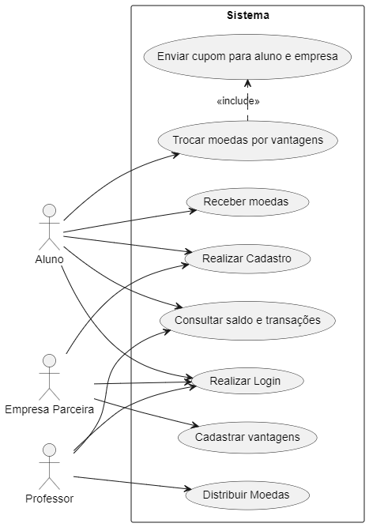
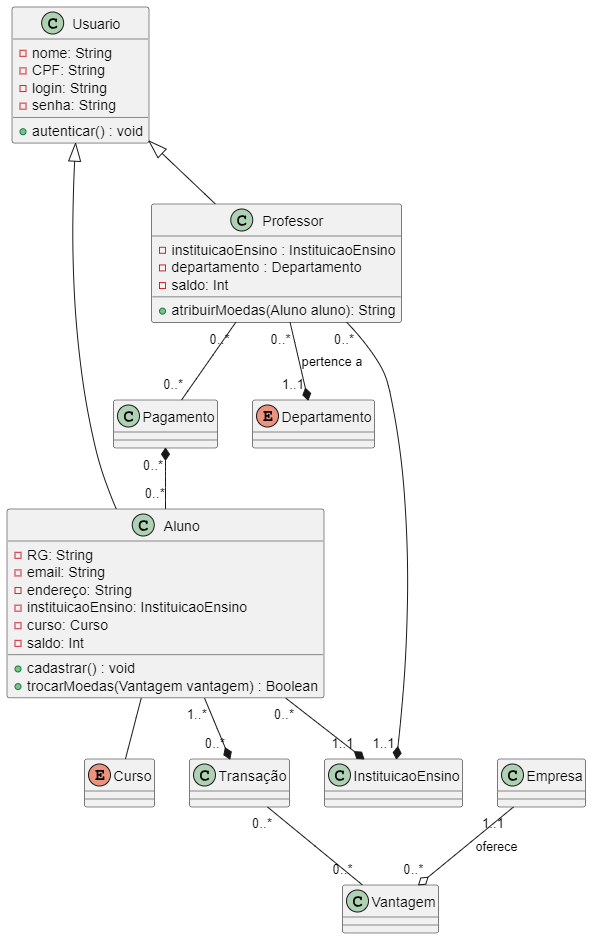

# Sistema de Moeda Estudantil

Este projeto é um protótipo de aplicação de sistema de moeda estudantil, desenvolvido Spring Boot e React.js.

Trata-se de um projeto acadêmico desenvolvido para a disciplina de Laboratório de Desenvolvimento de Software, do curso de Engenharia de Software da Pontifícia Universidade Católica de Minas Gerais (PUC Minas).

## Integrantes
* Gustavo Menezes Barbosa 
* Pedro Henrique Dias Camara 
* Milena Lara Reis Ferreira

## Orientadores
* Cristiano de Macêdo Neto 

## Descrição do Problema

Os alunos que desejam ingressar no sistema de mérito devem realizar um cadastro, indicando nome, email, CPF, RG, Endereço, Instituição de Ensino e curso. As instituições participantes já estão pré-cadastradas no sistema, para que o aluno selecione.

Os professores já estarão pré-cadastrados no sistema (a instituição envia a lista no momento da parceria). Cada professor terá armazenado o seu nome, CPF e departamento que está vinculado. É necessário deixar explícito que ele faz parte de uma instituição.

A cada semestre, os professores recebe um total de mil moedas, que podem ser distribuídas aos seus alunos como forma de reconhecimento por bom comportamento, participação em aula, etcs. Esse total é acumulável no semestre (isto é, se o professor não distribuir todas as moedas num semestre, o total de 1.000 novas moedas será adicionado ao seu saldo corrente).

Para enviar moedas, o professor deve possuir saldo suficiente, indicando qual aluno deverá receber o montante, bem como o motivo pelo qual ele está sendo reconhecido (uma mensagem aberta, obrigatória).

Ao receber uma moeda, o aluno deve ser notificado por email. 

Professores e alunos devem ser capazes de consultar o extrato de sua conta, visualizando o total de moedas que ainda possui, bem como as transações que realizou (para o professor, o envio de moedas; para o aluno, recebimento ou troca de moedas).

Para trocar moedas, o aluno deve selecionar uma das vantagens cadastradas no sistema. Elas incluem, por exemplo: desconto em restaurantes da universidade, desconto de mensalidade, ou compra de materiais específicos.

Empresas que sejam realizar parceria também devem se cadastrar no sistema, incluindo as vantagens que deseja oferecer e o custo de cada uma dela (em moedas).

Para cadastrar uma vantagem, a empresa parceira deve adicionar também uma descrição e foto do produto.

Ao resgatar uma vantagem, o aluno deve ter o valor descontado do seu saldo. Um email de cupom deve ser enviado para que ele utilize na troca presencial. Um email também deve ser enviado ao parceiro, para que ele possa conferir a troca. Ambos os emails devem incluir um código gerado pelo sistema, a fim de facilitar o processo de conferência.

Por fim, alunos, professores e empresas parceiras precisam ter um login e uma senha cadastrados para acessar o sistema. Em todos os casos, um processo de autenticação é necessário para realização dos requisitos.

## História de Usuário

Eu, como professor, quero distribuir minhas moedas para alunos como desejo para encorajar bom comportamento. Além disso, eu quero me cadastrar e realizar login para poder gerenciar meus dados. 

Eu, como aluno, quero ser capaz de utilizar as moedas fornecidas para comprar diversas vantágens. Além disso, eu quero me cadastrar e realizar login para poder gerenciar meus dados. Finalmente, eu quero poder consultar meu saldo de meodas e as possíveis vantagens para poder realizar minhas transações.

Eu, como empresa, quero distribuir vantagens para alunos que tenham as moedas suficientes. Além disso, eu quero me cadastrar e realizar login para poder gerenciar meus dados. 

## Casos de Uso

## Diagrama de Classes

## Modelo Entidade Relacionamento

## Definição e implementação da estratégia de acesso ao banco de dados

No nosso projeto, optamos por utilizar o repositório (_repository_) como estratégia de acesso de banco de dados. O repository abstrai a manipulação dos dados, trazendo o foco para os objetos de domínio do negócio, desacoplando a camada de negócios da camada de persistência.

Hoje, o _repository_ é o padrão mais utilizado em arquiteturas modernas, como a arquitetura orientada ao domínio (Domain-Driven Design). Ele fornece diversos métodos para fazer as operações mais comuns do CRUD e, em muitos casos, não precisamos nos preocupar em escrever comandos de manipulação de dados da linguagem de consulta (query) escolhida. Isso facilita a separação entre essas camadas e a substituição da tecnologia de gerenciamento de dados.

Como _server-side_ nossa aplicação está sendo desenvolvido em Spring Boot, estamos utilizando o framework **Spring Data JPA**, que simplifica a implementação da **Jakarta Persistence API (JPA)**. 

### Jakarta Persistence API (JPA)

**Jakarta Persistence** é parte do **Jakarta EE**, uma série de especificações desenvolvidas originalmente pela Oracle e, posteriormente, pela Eclipse Foundation, para a produção de software comercial utilizando Java. O módulo de Persistence trata especificamente da gestão da     persistência de dados e do mapeamento do modelo orientado a objetos para o modelo relacional em ambientes Java.

Através de sua API (JPA), é possível implementar de maneira simplificada uma série de operações de CRUD, utilizando anotações que abstraem as operações no banco de dados. Isso é feito através da Entity Manager API, que faz a gestão do ciclo de vida das entidades na aplicação.

Outra vantagem da JPA é que ela proporciona ao desenvolver um maior controle da granularidade de suas classes entidade (entity classes) e seus dados. As tabelas de banco de dados podem ser mapeadas diretamente em objetos java utilizando as anotações. De maneira geral, podemos dizer que cada classe se torna uma tabela, e cada atributo da classe se torna uma coluna dessa tabela. Mas vale notar que é possível utilizar algumas anotações que permitem mapeamentos mais flexíveis. Por exemplo, podemos criar, com anotações, chaves-estrangeiras e tabelas de relacionamento. É possível ainda utilizar anotações para unir duas classes em uma única tabela. 

Estes são os exemplos de algumas das principais anotações da JPA:
- `@Entity`: Utilizada antes da declaração da classe, informa ao JPA que a ele deve ser gerenciada pelo contexto de persistência, e suas instâncias representam linhas da tabela.
- `@Table(name = 'table_name')`: Utilizada antes da declaração da classe para indicar que ela será mapeada como uma tabela. O parâmetro "name" faz a conversão entre convenções de nomeação: _HungarianCase_ para classes e *snake_case* para tabelas de banco de dados. Permite ainda especificar outras configurações, como esquemas e restrições.
- `@Column(name = 'column_name)`:  Utilizada antes da declaração de um atributo para indicar que ele será mapeado como uma coluna da tabela. O parâmetro "name" faz a conversão entre convenções de nomeação: *camelCase* para atributos e *snake_case* para colunas de banco de dados.
- As anotações `@OneToOne`, `@OneToMany`, `@ManyToOne` e `@ManyToMany` servem para mapear atributos das classes como relacionamentos entre tabelas, sendo que mapeaiam, respectivamente, relacionamentos 1:1, 1:N, N:1 e N:N. Esses relacionamentos são implementados no modelo relacional por meio de chaves estrangeiras, e o nome do campo que armazenará a chave é declarado com a anotação `@JoinColumn(name = 'nome_chave_estrangeira')`.
- `@Id` é  utilizada para indicar que um atributo é a chave primária de uma tabela, e costuma ser combinada com @GeneratedValue, que define a estratégia de geração do ID:
    - `@GeneratedValue(strategy = GenerationType.AUTO)`: O JPA escolhe automaticamente a estratégia de geração de chave com base no banco de dados que está sendo utilizado.
    - `@GeneratedValue(strategy = GenerationType.IDENTITY)`: O banco de dados controla a geração da chave primária, geralmente usando colunas AUTO_INCREMENT ou equivalentes.
    - `@GeneratedValue(strategy = GenerationType.SEQUENCE)`: Usa uma sequência definida no banco de dados para gerar os IDs. Permite a geração de IDs antes da inserção (diferente de IDENTITY), o que é útil para algumas operações em lote.
    - `@GeneratedValue(strategy = GenerationType.TABLE)`: Usa uma tabela específica no banco de dados para armazenar os IDs gerados, simulando o comportamento de uma sequência.

Fontes:
- https://jakarta.ee/learn/specification-guides/persistence-explained/
- https://docs.spring.io/spring-data/jpa/reference/jpa.html

### H2 Database

Como mencionamos anteriormente, através da Spring Data JPA, podemos fazer alterações na base de dados sem afetar o servidor da aplicação: basta trocar as dependências do banco de dados no arquivo `pom.xml`.

Por estarmos em uma fase preliminar do projeto, optamos por utilizaro H2, que é uma base de dados que vem embutido com o servidor do Spring Boot. A por ele é interessante nessa fase porque não requer nenhuma configuração ou instalação adicional. Para acessar a interface do H2, basta visitar o endereço http://localhost:8080/h2-console no navegador, e utilizar as credenciais de acesso salvas no arquivo `application.properties`.

O H2 é uma base de dados relacional que utiliza SQL para executar as queries. Embora seja possível armazenar dados de forma persistente com o H2, no Spring Boot, ele vem com um armazenamento em memória RAM por padrão. Isto é, os dados não são salvos quando o servidor local é interrompido. Uma forma de garantir que a base de dados tenha pelo menos alguns registros para poder fazer os testes das operações de CRUD é salvar alguns comandos de insert dentro de um arquivo `database.sql`, que deve ser armazenado no diretório `src/main/resources`.

### Credenciais de acesso e variáveis de ambiente

Guardar as credenciais do banco de dados em um ambiente seguro e não fazer o upload delas no repositório é uma medida crítica de cyber segurança. Existem diversas abordagens para fazer isso, como utilizar um arquivo `.env` que salvar todas as informações sensíveis e que deve ser adicionado a um `.gitignore` para que seja utilizado somente localmente. No entanto, o uso do arquivo `.env` ou abordagens semelhantes ainda não é muito seguro, porque esse arquivo pode ser enviado para o repositório remoto acidentalmente.

A forma mais segura de armazenar as credenciais do banco de dados é substituindo-as por algumas variáveis no `application.properties` e armazenando os seus valores nas variáveis de ambiente do sistema operacional ou da IDE.

Planejamos adotar essa estratégia mais adiante, na ocasião de fazermos o deploy da aplicação.